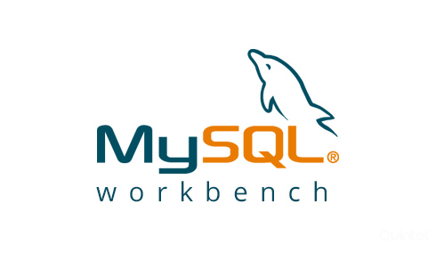

# Case Study - Classification
## What customer will accept a credit card? :bank:
Mid-course project: Data Analytics Ironhack Bootcamp, Berlin - 2021  

Dolores Umbridge Team:  
- Karina Condeixa
- Davis Pudans
- Prebitha Abraham

### Scenario
"You are working as a risk analyst with a bank. Apart from the other banking and loan services, the bank also provides credit card services that are a very important source of revenue for the bank. The bank wants to understand the demographics and other characteristics of its customers that accept a credit card offer and that do not accept a credit card. 

Usually, the observational data for these kinds of problems is somewhat limited in that often the company sees only those who respond to an offer. To get around this, the bank designs a focused marketing study, with 18,000 current bank customers. This focused approach allows the bank to know who does and does not respond to the offer, and to use existing demographic data that is already available on each customer." 

### Objective
Build a model that will provide insight into why some bank customers accept credit card offers. There are also other potential areas of opportunities that the bank wants to understand from the data. 

Your senior management has also posted these other questions that will help them better understand their customers. 

### Dataset
All the necessary files, as well as the dataset, can be found in the following repository: Mid-bootcamp project - Classification. 

The data set consists of information on 18,000 current bank customers in the study. These are the definitions of data points provided: 

- Customer Number: A sequential number assigned to the customers (this column is hidden and excluded – this unique identifier will not be used directly). 
- Offer Accepted: Did the customer accept (Yes) or reject (No) the offer. R- eward: The type of reward program offered for the card. 
- Mailer Type: Letter or postcard. 
- Income Level: Low, Medium, or High. 
- Bank Accounts Open: How many non-credit-card accounts are held by the customer. 
- Overdraft Protection: Does the customer have overdraft protection on their checking account(s) (Yes or No). 
- Credit Rating: Low, Medium, or High. 
- Credit Cards Held: The number of credit cards held at the bank. 
- Homes Owned: The number of homes owned by the customer. 
- Household Size: The number of individuals in the family. 
- Own Your Home: Does the customer own their home? (Yes or No). 
- Average Balance: Average account balance (across all accounts over time). Q1, Q2, Q3, and Q4 
- Balance: The average balance for each quarter in the last  

## Statements
[Look the statements](https://github.com/ironhack-edu/data_mid_bootcamp_project_classification)

## Deliveries to make
1. Slides deck
2. Oral presentation
3. [SQL queries](https://github.com/ironhack-edu/data_mid_bootcamp_project_classification/blob/master/sql_questions_classification.md)
4. [A Tableau ](https://github.com/ironhack-edu/data_mid_bootcamp_project_classification/blob/master/tableau_classification.md)
5. [Python code](https://github.com/ironhack-edu/data_mid_bootcamp_project_classification)
6. [A Tableau dashboard](https://github.com/ironhack-edu/data_mid_bootcamp_project_classification/blob/master/tableau_classification.md)

 
 

# What did we do?
We used a Progressive Regression model to predict which customers accept or reject credit card offers, using the bank credit card holder data set.

### Python
- Read data from xlsx files
- Made data cleaning
- EDA - exploratory data analysis with seaborn
- Categorized some of the numerical data
- Made data wrangling
- Create a model (Normalizing numerical data, Splitting train and test data, Applying the Progressive Regression model, Evaluating accuracy and testing)
- Run and evaluate the model
- Applied SMOTE to reduce the imbalance
- Made feature engineering (handling outliers, binning, dropping unnecessary data, multicollinearity )
- Run and evaluate the model again   
We explore different options seeking to find a better score. 

SMOTE: *"SMOTE is an oversampling technique where the synthetic samples are generated for the minority class. This algorithm helps to overcome the overfitting problem posed by random oversampling.6 Oct 2020"*([source](https://www.analyticsvidhya.com/blog/2020/10/overcoming-class-imbalance-using-smote-techniques/#:~:text=SMOTE%20is%20an%20oversampling%20technique,problem%20posed%20by%20random%20oversampling.))

### Tableau
- Visualize the existing data
- Create calculated fields to explore a deeper subset of data.
- Create a dashboard visualizing data about customer that accepted the bank offer.

### SQL
- Import the database and creating the table
- Run queries, create views to analyse the data

### Contents
- [Slides deck](https://docs.google.com/presentation/d/1Jzd05a98Ob2st5BEyBJGPtbX-rolYMsk55iZL7zcYLo/edit?usp=sharing)
- [SQL queries](sql_file/credit_card_data.sql) 
- Tableau  
[Tableau dashboard](https://public.tableau.com/profile/karina.condeixa#!/vizhome/Data-Mid-Bootcamp-Project-Classification2_16190361733800/Dashboard_1?publish=yes) 
[Tableau questions](https://public.tableau.com/profile/davis.pudans#!/vizhome/Case-study-classification-questions/Question8)

- Python  
[model iteration 1](python_files/case_study_classification.ipynb): data cleaning and data wrangling 
[model iteration 2](python_files/case_study_classification_B.ipynb): feature engineering, handiling outliers based on box plots for balance columns, dropping columns with unrelated data - mailer type, dropping columns with insufficient data - Q1 balance, dropping columns with multiloinerar data - Q2 balance 
[model iteration 3](python_files/case_study_classification_A-1.ipynb): upsampling - manual copying of YES records in the data set 
[model iteration 4](python_files/case_study_classification_C.ipynb): binning of Household size 
[model iteration 5](python_files/case_study_classification-bin.ipynb): binning and dropping  Avg balance 
[model iteration 6](python_files/case_study_classification_bins_coulmn_difference.ipynb): binning and datawrangling (difference in Q1&Q2 and Q3&Q4) 
[model iteration 7](python_files/case_study_classification_bins_coulmn_sum.ipynb): binning + Datawrangling - sum - q1,q2,q3,q4 

## General conclusions
The best experiment was the one of the hypothesis 5 where we made binning and data wrangling for Q1, Q2, Q3, Q4. This experiment meet the best accuracy score. 

It dealts with the imbalances with SMOTE and removed outliers using IQR. The better hypothesis the 5th one where we did binning using Q-cut to the Household Size column and wrangled the data on columns with the quarterly balances into half-yearly balances. 

## Limitations
The data set had a high imbalance for the target variable (95%) which led to rather low accuracy and needed to be handled using SMOTE. Dropping outliers and creating bins slightly improved accuracy, but dropping multicollinear data mostly didn’t. Overall, the accuracy ranged from 69-72% by applying different feature engineering techniques. 

Regarding Tableau, there was almost no distinct pattern that separated customers that accepted the credit card offer or not. It could be observed that customers with low income and low credit ratings are more likely to accept the offer. On the other hand, customers with higher average balance and higher average credit ratings are very unlikely to accept the offer.
 

## Tools

     

